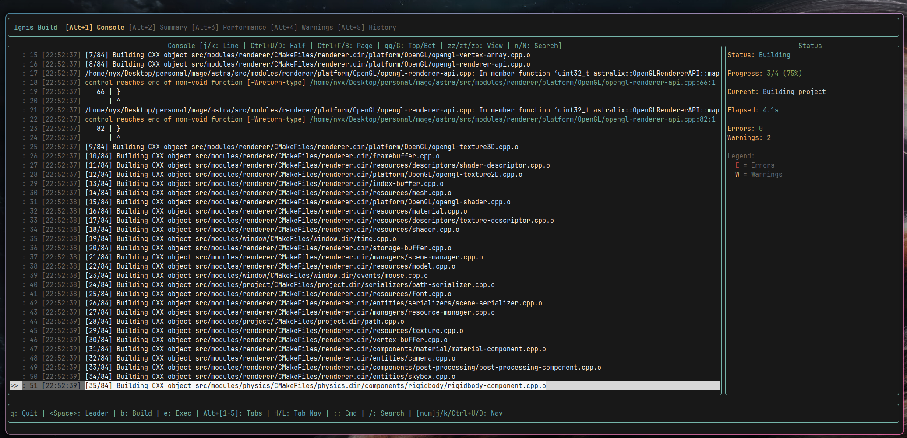

# Ignis

CMake build orchestrator with stage-based execution and a TUI.




## Why?

Built for the [Astra game engine](https://github.com/LuizPedroSousa/astra) which has multiple CMake targets. Standard CMake workflow was too slow for iterative development.

**Build Iteration:**
- Skip configuration when only source files changed
- Run specific stages instead of full rebuilds
- See which stage failed immediately

**Development workflow:**
- Navigate thousands of log lines with vim keybindings instead of scrolling
- Jump directly to errors with file:line references
- Compare build times across presets and configurations
- Identify which changes broke the build and see error/warning trends over time

## How it works

```
PreValidation -> Configure -> Build -> Install (concurrent)
                              |
                         PostBuild (concurrent)
                              |
                            Test
```

Stages with same dependencies run in parallel. When a stage fails, dependent stages are skipped.
<!-- [print: screenshot of stage dependency graph visualization] -->

## Installation

Requires Rust 1.70+ and CMake 3.20+

```bash
git clone https://github.com/LuizPedroSousa/ignis.git
cd ignis

# Linux/macOS
./install.sh

# Windows
install.bat
```

The installer will:
- Build ignis in release mode
- Install binary to `~/.local/bin` (or `/usr/local/bin` with sudo)
- Create config directory at `~/.config/astralix`
- Set up build history directory

For custom installation:
```bash
./install.sh --prefix=/custom/path    # Custom install location
./install.sh --debug                  # Install debug build
./install.sh --uninstall              # Remove ignis
```

## Usage

Initialize project:
```bash
ignis init
```

Creates `ignis.toml`:
```toml
[build]
kind = "root"
name = "MyProject"

[stages]
enabled = ["PreValidation", "Configure", "Build", "Install"]
```

Start TUI:
```bash
ignis
```

Commands:
```bash
ignis --no-tui          # No TUI mode
ignis presets           # List presets
ignis --preset release  # Use preset
ignis clean             # Clean artifacts
```

## Keybindings

| Key | Action |
|-----|--------|
| `b` | Rebuild |
| `c` | Clean + Rebuild |
| `q` | Quit |
| `j/k` | Scroll logs |
| `g/G` | Jump to top/bottom |
| `/` | Search |
| `<Space>` | Leader key |

Configurable in `~/.config/astralix/ignis.toml`

## Configuration

Global (`~/.config/astralix/ignis.toml`):
```toml
[display]
theme = "dark"
show_timestamps = true
max_log_lines = 10000

[keybindings]
leader_key = "Space"
enable_leader = true

[editor]
command = "code"
vscode_integration = true
```

Project (`ignis.toml`):
```toml
[build]
kind = "installer"  # "root" or "executable"
name = "MyApp"

[stages]
enabled = ["Configure", "Build", "Install", "Test"]

[stages.dependencies]
Test = ["Build"]  # Custom dependency override
```


## Multi-target projects

Before build:
```
project/
├── ignis.toml (kind = "root")
├── core/
│   └── ignis.toml (kind = "executable")
└── some-lib/
    └── ignis.toml (kind = "installer")
```

After build:
```
project/
├── ignis.toml (kind = "root")
├── install/
│   ├── bin/
│   └── lib/
├── core/
│   ├── ignis.toml (kind = "executable")
│   └── builds/
│       └── debug/
│           ├── CMakeCache.txt
│           └── core.exe
└── some-lib/
    ├── ignis.toml (kind = "installer")
    └── builds/
        └── debug/
            └── some-lib.a
```

Discovers targets recursively from the root `ignis.toml` and builds in dependency order.

## Stages

Built-in:
- PreValidation - Environment checks (optional)
- Configure - CMake configuration
- Build - Compilation
- Install - Install artifacts
- Clean - Remove build dirs
- PostBuild - Post-processing (optional)
- Test - Run tests (optional)
- Exec - Execute compiled targets 

Dependencies:
- `Build` requires `Configure`
- `Install` and `PostBuild` run in parallel after `Build`
- Failed stages skip dependents

Override in config:
```toml
[stages.dependencies]
PostBuild = ["Build", "Install"]
```

## Roadmap
**Current features:**
- [x] Stage-based builds with dependency management
- [x] Concurrent stage execution
- [x] TUI with vim keybindings
- [x] Multi-target CMake project support
- [x] Resource monitoring (CPU, memory, build time)
- [x] Build and execution history tracking
- [x] Console log filtering and search
- [x] Regex based for compile errors
- [x] Preset switching
- [x] Run executable targets from TUI

**Planned:**

**Build Performance:**
- [ ] Watch mode - auto-rebuild on file changes
- [ ] Build cache integration (ccache, sccache)
- [ ] Build distribution across machines
- [ ] Incremental compilation tracking

**Extensibility:**
- [ ] Custom stage definitions in config
- [ ] Plugin system for custom stages
- [ ] Pre/post hooks for stages
- [ ] Custom log parsers

**Developer Experience:**
- [ ] Notifications on build completion
- [ ] Benchmark comparisons (time, memory)
- [ ] LSP integration for compile errors
- [ ] Interactive stage debugging
- [ ] Syntax highlighting in console

**Integrations:**
- [ ] More IDE integrations (Neovim, IntelliJ)
- [ ] Git integration (track builds per commit)
- [ ] Package manager support (Conan, vcpkg)

## License

MIT
